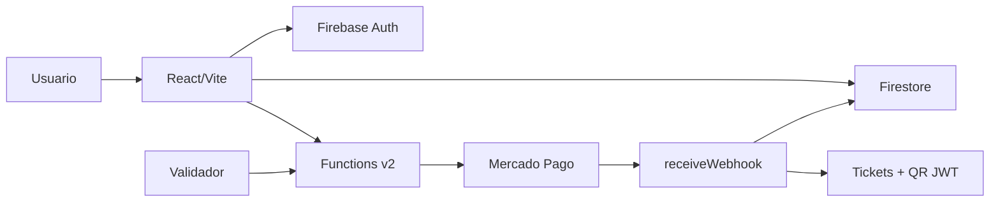

# IngressosZ

IngressosZ e uma plataforma de ingressos digitais para eventos pequenos e
medios. O projeto cobre descoberta de eventos, checkout, Pix, webhook de
pagamento, emissao de tickets com QR Code e validacao presencial.

O objetivo atual e servir como projeto de portfolio com um fluxo realista de
produto, backend e seguranca. Para uso comercial amplo, ainda ha validacoes
operacionais e legais mapeadas na documentacao.

## Demo

- Site publicado: https://<your-firebase-project-id>.web.app
- Repositorio: https://github.com/Fulanalok/IngressosZ

## Destaques

- Frontend React/Vite publicado no Firebase Hosting.
- Backend serverless com Firebase Functions v2.
- Checkout Pro e Pix via Mercado Pago.
- Webhook Mercado Pago com validacao HMAC.
- `paymentSessions` para rastrear a intencao de pagamento.
- Tickets digitais com QR Code JWT assinado.
- Validador presencial com controle de role.
- Painel admin para eventos, roles, vendas e reembolsos.
- Firestore Rules e Storage Rules para proteger escrita sensivel.
- Documentacao separando portfolio/demo de pendencias de producao comercial.

## Stack

| Camada | Tecnologias |
| --- | --- |
| Frontend | React 19, TypeScript, Vite, Tailwind CSS v4 |
| Estado/dados | TanStack Query, Firebase SDK |
| Backend | Firebase Functions v2, Node.js 24, TypeScript |
| Banco | Cloud Firestore |
| Storage | Firebase Storage |
| Auth | Firebase Authentication |
| Pagamentos | Mercado Pago Checkout Pro e Pix |
| Observabilidade | Sentry |
| Testes | Vitest, Testing Library, Cypress, Mocha |

## Arquitetura resumida



Fluxo principal:

1. Usuario escolhe evento e quantidade.
2. Frontend cria `paymentSessions/{id}` no Firestore.
3. Frontend chama Checkout ou Pix.
4. Mercado Pago confirma via webhook.
5. Backend valida a assinatura, consolida compra e emite tickets.
6. QR Code e validado por usuario com role permitida.

## Estrutura do repositorio

```text
.
|-- docs/                    # Documentacao publica para GitHub/portfolio
|-- ingressosZ/              # Frontend React/Vite
|-- functions/               # Firebase Functions
|-- architecture/            # Contexto tecnico interno
|-- ops/                     # Contexto operacional interno
|-- planning/                # Checklist e roadmap
|-- firestore.rules          # Regras Firestore
|-- storage.rules            # Regras Storage
|-- firebase.json            # Hosting, Functions e emuladores
`-- package.json             # Scripts do monorepo
```

## Rodando localmente

Instale dependencias:

```bash
npm install
npm run install:all
```

Frontend:

```bash
npm --prefix ingressosZ run dev
```

Functions/emuladores:

```bash
firebase emulators:start
```

## Qualidade

Frontend:

```bash
npm --prefix ingressosZ run lint
npm --prefix ingressosZ run typecheck
npm --prefix ingressosZ run build
npm --prefix ingressosZ run test
```

Backend:

```bash
npm --prefix functions run lint
npm --prefix functions run build
npm --prefix functions run test
```

## Deploy

Deploy completo pela raiz:

```bash
npx firebase-tools deploy --only firestore:rules,storage,functions,hosting --project <your-firebase-project-id>
```

## Status

Pronto para demonstracao controlada no LinkedIn como projeto de portfolio.

Antes de uso comercial amplo, ainda faltam validacoes reais de Mercado Pago,
webhook, Pix/cartao, e-mail transacional, QR Code, reembolso/admin, App Check e
revisao legal.

## Documentacao

- [docs/README.md](docs/README.md) - indice da documentacao.
- [docs/PROJECT.md](docs/PROJECT.md) - visao de produto e escopo.
- [docs/ARCHITECTURE.md](docs/ARCHITECTURE.md) - arquitetura e fluxo tecnico.
- [docs/OPERATIONS.md](docs/OPERATIONS.md) - setup, qualidade e deploy.
- [docs/SECURITY.md](docs/SECURITY.md) - seguranca e pendencias.
- [docs/PUBLIC_RELEASE_SECURITY.md](docs/PUBLIC_RELEASE_SECURITY.md) -
  checklist para publicacao segura do repositorio.
- [docs/LINKEDIN.md](docs/LINKEDIN.md) - guia para apresentar o projeto.
- [functions/API.md](functions/API.md) - contratos e Functions backend.
- [planning/CHECKLIST_FINALIZACAO.md](planning/CHECKLIST_FINALIZACAO.md) -
  checklist operacional detalhado.
