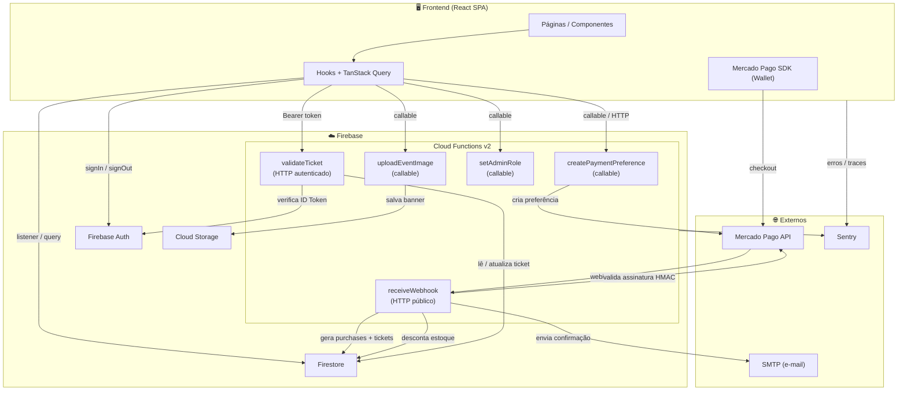

# IngressosZ - Plataforma completa para eventos e ingressos

**IngressosZ** é uma plataforma de ponta a ponta para criação de eventos, venda de ingressos digitais e validação presencial com QR Code. A ideia do produto é resolver o ciclo completo do organizador: publicar eventos, vender ingressos com pagamento online, emitir tickets com segurança e oferecer um validador simples para controlar o acesso. A experiência é pensada para ser rápida para o comprador e operacionalmente confiável para quem organiza, com rastreabilidade e atualização automática do estoque.

O projeto está estruturado como monorepo e já possui os fluxos essenciais implementados em produção e emuladores. O frontend é uma SPA moderna com foco em UX, enquanto o backend serverless centraliza pagamento, emissão de ingressos, validação e envio de e-mails.

## 📦 Estrutura do projeto

- **[/ingressosZ](./ingressosZ/README.md)**: SPA em React 19 + Vite + TypeScript.
- **/functions**: Firebase Cloud Functions v2 (Node.js 24).
- **firebase.json**: hosting do frontend, functions, emuladores e regras.
- **firestore.rules / storage.rules**: regras do Firestore e Storage.

## 💡 Ideia do produto

O objetivo é unir em um só lugar o que normalmente fica espalhado entre planilhas, sistemas de pagamento e conferência manual de entradas. O fluxo pensado é:

- O organizador cria um evento e define tipos de ingresso, estoque e preço.
- O comprador escolhe o ingresso, realiza o pagamento pelo Mercado Pago e recebe a confirmação.
- O sistema emite tickets digitais com QR Code assinado.
- Na portaria, o validador verifica o QR e marca o ingresso como usado.

Isso permite escalar a venda sem aumentar esforço manual, reduz fraudes na entrada e dá previsibilidade de estoque e receita.

## ✅ Estado atual do projeto

O projeto já cobre os blocos fundamentais, com integração real de pagamento e emissão:

- **Checkout Mercado Pago** com preferência de pagamento gerada pelo backend.
- **Webhook de pagamento** com verificação de assinatura (HMAC quando configurado).
- **Emissão de tickets** com QR Code assinado e persistência no Firestore.
- **Validador de ingressos** via endpoint HTTP seguro com autenticação.
- **Compra autenticada**: criação de preferência exige usuário logado.
- **Administração** de eventos e roles (organizer/admin).
- **E-mails transacionais** para confirmação de compra e entrega de tickets.
- **Upload e otimização de imagens** para banners de eventos via Cloud Storage.
- **Observabilidade** com Sentry no frontend e backend.
- **Dados de teste** gerados por funções seed no backend (sem criação no cliente).

Isso coloca o produto em um estágio avançado de MVP funcional, pronto para testes comerciais controlados.

## 🧱 Stack e arquitetura

- **Frontend:** React 19, Vite 7, TypeScript, Tailwind CSS v4.
- **Roteamento:** React Router v7.
- **Dados:** TanStack Query v5 para cache e sincronização.
- **Backend:** Firebase Functions v2 (Node.js 24).
- **Banco:** Firestore.
- **Pagamentos:** Mercado Pago (Checkout Pro).
- **Observabilidade:** Sentry (frontend e functions).

### Diagrama de arquitetura



## ⚙️ Configuração local

### Requisitos

- Node.js 24 (obrigatório para `/functions`, recomendado para todo o monorepo).
- Firebase CLI configurado no ambiente local.

### Instalação

Frontend:

```bash
cd ingressosZ
npm install
```

Backend:

```bash
cd functions
npm install
```

### Variáveis do frontend (`/ingressosZ/.env.local`)

O frontend usa variáveis `VITE_*`. Você pode manter o `firebaseConfig.ts` lendo direto do `.env`.

```env
VITE_FIREBASE_API_KEY="sua_api_key"
VITE_FIREBASE_AUTH_DOMAIN="seu_auth_domain"
VITE_FIREBASE_PROJECT_ID="seu_project_id"
VITE_FIREBASE_STORAGE_BUCKET="seu_storage_bucket"
VITE_FIREBASE_MESSAGING_SENDER_ID="seu_messaging_sender_id"
VITE_FIREBASE_APP_ID="seu_app_id"
VITE_FIREBASE_MEASUREMENT_ID="seu_measurement_id"
VITE_MERCADOPAGO_PUBLIC_KEY="sua_chave_publica_do_mercado_pago"
VITE_FUNCTIONS_REGION="southamerica-east1"
VITE_FUNCTIONS_PORT="5001"
VITE_API_URL=""
VITE_SENTRY_DSN=""
```

### Secrets e Params das Functions (`/functions`)

O backend usa **Secrets** do Firebase Functions para credenciais sensíveis:

- `MP_ACCESS_TOKEN`
- `MP_WEBHOOK_SECRET`
- `JWT_SECRET`
- `SMTP_EMAIL`
- `SMTP_PASSWORD`

E usa **Params** para valores configuráveis:

- `SMTP_HOST` (padrão: `smtp.gmail.com`)
- `SMTP_PORT` (padrão: `465`)
- `WEB_BASE_URL` (ex.: `https://ingressosz.web.app`)
- `SENTRY_DSN` (opcional)

Exemplo para secrets via CLI:

```bash
npx firebase-tools functions:secrets:set MP_ACCESS_TOKEN
npx firebase-tools functions:secrets:set MP_WEBHOOK_SECRET
npx firebase-tools functions:secrets:set JWT_SECRET
npx firebase-tools functions:secrets:set SMTP_EMAIL
npx firebase-tools functions:secrets:set SMTP_PASSWORD
```

## 🧪 Execução local

Frontend:

```bash
cd ingressosZ
npm run dev
```

Functions (emulador):

```bash
cd functions
npm run serve
```

O frontend faz proxy para `/functions` usando `VITE_FIREBASE_PROJECT_ID` e `VITE_FUNCTIONS_REGION`.

> **Emuladores disponíveis:** O `firebase.json` configura emuladores para Auth (9099), Functions (5001), Firestore (8086) e Storage (9199), com UI habilitada. Para rodar todos os emuladores juntos:
>
> ```bash
> npx firebase-tools emulators:start
> ```

## 🧪 Testes

Frontend (Vitest):

```bash
cd ingressosZ
npm test
```

Backend (Mocha):

```bash
cd functions
npm test
```

## 🚀 Deploy

### Frontend

```bash
cd ingressosZ
npm run build
firebase deploy --only hosting
```

### Backend

```bash
cd functions
firebase deploy --only functions
```

Depois do deploy, configure a URL da função `receiveWebhook` no painel do Mercado Pago.

### Completo (hosting + functions)

```bash
firebase deploy
```

## 🔁 Fluxos principais (detalhados)

### Checkout, preferência e pagamento

1. Usuário autenticado inicia a compra.
2. O frontend cria um `paymentSession` no Firestore.
3. O app chama `createPaymentPreference` (callable) ou o endpoint público quando necessário.
4. O Mercado Pago responde com o `preferenceId`.
5. O componente `Wallet` do Mercado Pago inicia o checkout.

### Webhook e emissão de tickets

1. O Mercado Pago chama `receiveWebhook` com o status do pagamento.
2. O backend valida assinatura (quando `MP_WEBHOOK_SECRET` está configurado).
3. Em pagamento aprovado:
   - cria `purchases`;
   - desconta estoque do evento no backend;
   - gera `tickets` com QR Code assinado;
   - dispara e-mail com dados da compra.

### Validação presencial

1. O usuário abre **Meus Ingressos**, pega o código do QR.
2. A página **/validador** chama `/functions/validateTicket`.
3. O backend valida assinatura do QR, marca como usado e retorna o resultado.

### Reembolsos (admin)

Há função `refundPayment` para solicitar reembolso no Mercado Pago, atualizar compra e cancelar tickets associados.

## 📍 Próximos passos (produto e comercial)

Para tornar o projeto comercialmente viável e escalável, os próximos passos recomendados são:

- **Fluxo de testes oficiais do Mercado Pago:** usar contas de teste e cartões de teste para simular aprovações, recusas e pendências antes de cobrar de verdade.
- **Política de reembolso e chargeback:** definir regras claras para organizadores e compradores, evitando disputas e retrabalho.
- **KYC do organizador:** validar organizadores com documentos mínimos e dados bancários para reduzir fraudes.
- **Taxas e repasse:** definir modelo de comissionamento, calendário de repasses e conciliação financeira.
- **Gestão de eventos com etapas:** considerar lotes, virada de preço e limitações por canal de venda.
- **Relatórios financeiros:** dashboard com receita, ingressos vendidos, reembolsos e taxas.
- **Monitoramento de falhas:** alertas para webhooks não entregues, quedas de e-mail e erros de validação.
- **Auditoria de acessos:** logs de validação para conferência na portaria e pós-evento.
- **Escalabilidade do validador:** rate limit e proteção extra para evitar abuso do endpoint.

## 🧭 Referências úteis

- Frontend: [README.md](./ingressosZ/README.md)
- Backend: [API.md](./functions/API.md)
