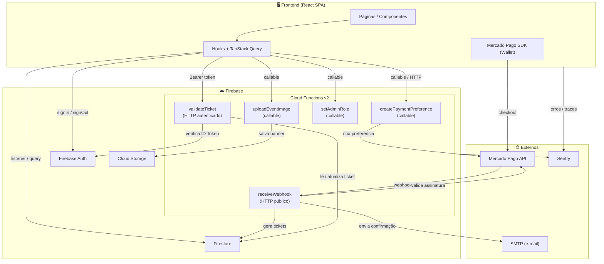

# IngressosZ — Plataforma dedicada de eventos e ingressos

**IngressosZ** é uma plataforma ponta a ponta para criação de eventos, venda de ingressos digitais e validação presencial com QR Code. Diferente de outros marketplaces, o IngressosZ é **dedicado a uma única empresa**, garantindo uma experiência personalizada, segura e de baixo custo operacional.

## 🎨 Filosofia e Identidade Visual

- **Single-Company**: Foco em atender as necessidades de uma única organização, simplificando a gestão e o checkout.
- **Premium Blue Identity**: O projeto utiliza uma paleta monocromática de azuis sofisticados (Deep Navy ao Sky Accent) para criar uma interface moderna, profissional e de alta profundidade visual.
- **Tipografia & Estética**: Uso da fonte **Outfit** para um visual de SaaS moderno, com elementos de **Glassmorphism**, bordas arredondadas (**1rem/1.5rem**) e sombras suaves.
- **Eficiência de Custos**: Arquitetura otimizada para o plano gratuito do Firebase (Spark), priorizando requisições sob demanda onde o tempo real não é crítico.
- **Mobile-First**: Experiência de uso fluida em celulares, garantindo que o cliente compre seu ingresso com poucos toques.

## 🔗 Links rápidos

- Frontend: [README.md](./ingressosZ/README.md)
- Backend (API): [API.md](./functions/API.md)

## ✅ O que já funciona

- UI Premium Blue completa (Home, Eventos, Ingressos, Fluxo de Compra).
- Checkout Mercado Pago (preferência gerada no backend).
- Webhook com verificação de assinatura (HMAC quando configurado).
- Emissão de tickets com QR Code assinado no Firestore.
- Validador de ingressos com endpoint HTTP autenticado.
- Painel admin para eventos e roles.
- Upload e otimização de imagens no Storage.
- E-mails transacionais de confirmação.
- Observabilidade com Sentry.

## 🧱 Stack

- Frontend: React 19, Vite 7, TypeScript, Tailwind CSS v4
- Roteamento: React Router v7
- Dados: TanStack Query v5
- Backend: Firebase Functions v2 (Node.js 24)
- Banco: Firestore
- Pagamentos: Mercado Pago (Checkout Pro)
- Observabilidade: Sentry (frontend e backend)

## 🧭 Estrutura do monorepo

- **/ingressosZ**: SPA em React
- **/functions**: Cloud Functions v2
- **firebase.json**: hosting, functions, emuladores e regras
- **firestore.rules / storage.rules**: regras de segurança

## 🧩 Arquitetura (alto nível)



## ⚙️ Pré-requisitos

- Node.js 24
- Firebase CLI

## ▶️ Setup local

Frontend:

```bash
cd ingressosZ
npm install
```

Backend:

```bash
cd functions
npm install
```

### Variáveis do frontend (`/ingressosZ/.env.local`)

```env
VITE_FIREBASE_API_KEY="sua_api_key"
VITE_FIREBASE_AUTH_DOMAIN="seu_auth_domain"
VITE_FIREBASE_PROJECT_ID="seu_project_id"
VITE_FIREBASE_STORAGE_BUCKET="seu_storage_bucket"
VITE_FIREBASE_MESSAGING_SENDER_ID="seu_messaging_sender_id"
VITE_FIREBASE_APP_ID="seu_app_id"
VITE_FIREBASE_MEASUREMENT_ID="seu_measurement_id"
VITE_MERCADOPAGO_PUBLIC_KEY="sua_chave_publica_do_mercado_pago"
VITE_RECAPTCHA_V2_SITE_KEY="sua_chave_publica_recaptcha_v2"
VITE_APPCHECK_RECAPTCHA_ENTERPRISE_KEY="sua_chave_appcheck_recaptcha_enterprise"
VITE_APPCHECK_DEBUG_TOKEN="false"
VITE_FUNCTIONS_REGION="southamerica-east1"
VITE_FUNCTIONS_PORT="5001"
VITE_API_URL=""
VITE_SENTRY_DSN=""
```

### Secrets e Params das Functions

Secrets (obrigatórios):

- `MP_ACCESS_TOKEN`
- `MP_WEBHOOK_SECRET`
- `JWT_SECRET`
- `SMTP_EMAIL`
- `SMTP_PASSWORD`
- `RECAPTCHA_V2_SECRET`

Params (com padrão):

- `SMTP_HOST` (smtp.gmail.com)
- `SMTP_PORT` (465)
- `WEB_BASE_URL` (https://ingressosz.web.app)
- `SENTRY_DSN` (opcional)

Exemplo (CLI):

```bash
npx firebase-tools functions:secrets:set MP_ACCESS_TOKEN
npx firebase-tools functions:secrets:set MP_WEBHOOK_SECRET
npx firebase-tools functions:secrets:set JWT_SECRET
npx firebase-tools functions:secrets:set SMTP_EMAIL
npx firebase-tools functions:secrets:set SMTP_PASSWORD
npx firebase-tools functions:secrets:set RECAPTCHA_V2_SECRET
```

## 🧪 Execução local

Frontend:

```bash
cd ingressosZ
npm run dev
```

Functions (emulador):

```bash
cd functions
npm run serve
```

Para subir tudo no emulador:

```bash
npx firebase-tools emulators:start
```

## ✅ Testes

Frontend:

```bash
cd ingressosZ
npm test
```

Backend:

```bash
cd functions
npm test
```

## 🚀 Deploy

Frontend:

```bash
cd ingressosZ
npm run build
firebase deploy --only hosting
```

Backend:

```bash
cd functions
firebase deploy --only functions
```

Após o deploy, configure a URL da função `receiveWebhook` no painel do Mercado Pago.

Deploy completo:

```bash
firebase deploy
```

## 🏁 Produção (checklist prático)

- Criar projeto Firebase separado (dev/staging/prod) e usar alias `prod`.
- Configurar domínio de produção em **Authentication → Authorized domains**.
- Enforçar **App Check** para Auth, Firestore, Functions e Storage.
- Publicar regras de Firestore/Storage do repo.
- Definir `WEB_BASE_URL` com o domínio real.
- Preencher `.env.production` no frontend:

```env
VITE_FIREBASE_API_KEY="..."
VITE_FIREBASE_AUTH_DOMAIN="..."
VITE_FIREBASE_PROJECT_ID="..."
VITE_FIREBASE_STORAGE_BUCKET="..."
VITE_FIREBASE_MESSAGING_SENDER_ID="..."
VITE_FIREBASE_APP_ID="..."
VITE_FIREBASE_MEASUREMENT_ID="..."
VITE_MERCADOPAGO_PUBLIC_KEY="..."
VITE_RECAPTCHA_V2_SITE_KEY="..."
VITE_APPCHECK_RECAPTCHA_ENTERPRISE_KEY="..."
VITE_FUNCTIONS_REGION="southamerica-east1"
VITE_API_URL="https://<region>-<project-id>.cloudfunctions.net"
VITE_SENTRY_DSN="..."
```

## 🔁 Fluxos principais

### Checkout e pagamento

1. Usuário autenticado inicia a compra.
2. O frontend cria `paymentSession` no Firestore.
3. O app chama `createPaymentPreference` (callable) ou endpoint público.
4. O Mercado Pago responde com `preferenceId`.
5. O `Wallet` inicia o checkout.

### Webhook e emissão

1. Mercado Pago chama `receiveWebhook`.
2. Backend valida assinatura (quando configurado).
3. Em pagamento aprovado: cria `purchases`, desconta estoque, gera `tickets` e envia e-mail.

### Validação presencial

1. Usuário abre **Meus Ingressos** e mostra o QR.
2. **/validador** chama `/functions/validateTicket`.
3. Backend valida e marca como usado.
