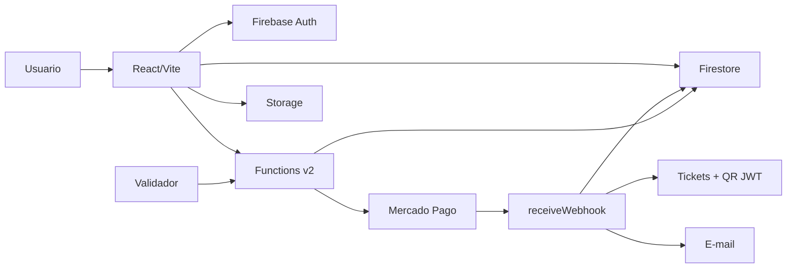

# Arquitetura

IngressosZ usa uma arquitetura Firebase-first para reduzir infraestrutura
operacional e manter o fluxo de compra rastreavel de ponta a ponta.

## Modulos principais

| Area | Responsabilidade |
| --- | --- |
| `ingressosZ/` | SPA React para eventos, checkout, ingressos, admin e validador. |
| `functions/` | Functions de pagamento, webhook, tickets, e-mail, roles e manutencao. |
| `firestore.rules` | Controle de leitura/escrita por colecao. |
| `storage.rules` | Upload protegido de imagens de eventos. |
| `firebase.json` | Configuracao oficial de Hosting, Functions e emuladores. |

## Fluxo de pagamento

1. Usuario autenticado escolhe evento, tipo de ingresso e quantidade.
2. Frontend cria `paymentSessions/{id}` no Firestore com estado `pending`.
3. Frontend chama `createPaymentPreference` ou `createPixPayment`.
4. Mercado Pago processa o pagamento.
5. Mercado Pago chama `receiveWebhook`.
6. Backend valida HMAC, consulta o pagamento e resolve a sessao.
7. Se aprovado, backend cria compra, decrementa estoque e emite tickets.
8. Ticket recebe QR Code JWT assinado.
9. E-mail transacional e enviado.
10. Validador le o QR Code e chama `validateTicket`.

## Colecoes Firestore relevantes

| Colecao | Papel |
| --- | --- |
| `events` | Eventos publicos e estoque disponivel. |
| `paymentSessions` | Sessao rastreavel antes e depois do pagamento. |
| `purchases` | Compra consolidada pelo backend. |
| `tickets` | Ingressos emitidos com QR Code. |
| `users` | Perfil e role do usuario. |

## Functions principais

| Function | Papel |
| --- | --- |
| `createPaymentPreference` | Cria preferencia de Checkout Pro. |
| `createPixPayment` | Cria pagamento Pix. |
| `receiveWebhook` | Processa notificacoes Mercado Pago. |
| `validateTicket` | Valida QR Code no acesso ao evento. |
| `refundPayment` | Executa reembolso administrativo. |
| `setAdminRole` / `setUserRole` | Gerencia roles/custom claims. |
| `onTicketCreated` | Complementa ticket e dispara e-mail. |
| `optimizeImage` | Otimiza imagens enviadas ao Storage. |

## Decisoes de arquitetura

- Sem Cloud SQL/Data Connect no estado atual para reduzir custo.
- Firestore como base operacional unica.
- Backend modularizado por dominio em `functions/src/endpoints/`.
- Cliente cria somente a intencao de pagamento; emissao final de ticket fica no
  backend apos webhook.
- QR Code usa assinatura JWT para reduzir risco de falsificacao.
- Validacao presencial depende do backend para bloquear reuso.

## Referencias

- [functions/API.md](../functions/API.md)
- [SECURITY.md](SECURITY.md)
- [OPERATIONS.md](OPERATIONS.md)
