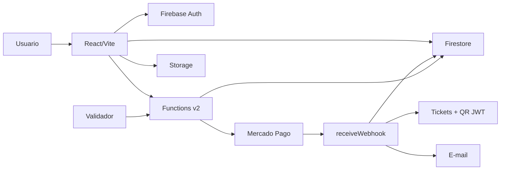

# Arquitetura

IngressosZ usa uma arquitetura Firebase-first para reduzir infraestrutura
operacional e manter o fluxo de compra rastreavel de ponta a ponta.

## Modulos principais

| Area | Responsabilidade |
| --- | --- |
| `ingressosZ/` | SPA React para eventos, checkout, ingressos, admin e validador. |
| `functions/` | Functions de pagamento, webhook, tickets, e-mail, roles e manutencao. |
| `firestore.rules` | Controle de leitura/escrita por colecao. |
| `storage.rules` | Upload protegido de imagens de eventos. |
| `firebase.json` | Configuracao oficial de Hosting, Functions e emuladores. |

## Fluxo de pagamento

1. Usuario autenticado escolhe evento, tipo de ingresso e quantidade.
2. Frontend chama `createPaymentSession` com evento, tipo, quantidade e metodo.
3. Backend valida estoque, calcula valores e cria a sessao por transacao.
4. Frontend chama `createPaymentPreference` ou `createPixPayment` somente com o
   ID da sessao.
   O backend assume um lease de 2 minutos em `providerState: creating` e usa
   uma chave de idempotencia deterministica por sessao e metodo nos retries.
5. Mercado Pago processa o pagamento e chama `receiveWebhook`.
6. Backend valida HMAC, consulta o pagamento e localiza a sessao por
   `external_reference` ou metadata compativel.
7. `paymentSessions` fornece exclusivamente os dados confiaveis da compra.
8. Uma transacao atomica cria compra e tickets, decrementa estoque e grava
   `paymentWebhookEvents/{paymentId}`; nao ha `status: processing`.
9. Ticket recebe QR Code JWT assinado e o e-mail best-effort ocorre apos commit.
10. Validador le o QR Code e chama `validateTicket`.

## Colecoes Firestore relevantes

| Colecao | Papel |
| --- | --- |
| `events` | Eventos publicos e estoque disponivel. |
| `paymentSessions` | Sessao rastreavel antes e depois do pagamento. |
| `paymentWebhookEvents` | Resultado terminal idempotente por pagamento. |
| `purchases` | Compra consolidada pelo backend. |
| `tickets` | Ingressos emitidos com QR Code. |
| `users` | Perfil e role do usuario. |

## Functions principais

| Function | Papel |
| --- | --- |
| `createPaymentSession` | Valida e cria sessao confiavel de pagamento. |
| `createPaymentPreference` | Cria preferencia de Checkout Pro. |
| `createPixPayment` | Cria pagamento Pix. |
| `receiveWebhook` | Processa notificacoes Mercado Pago. |
| `validateTicket` | Valida QR Code no acesso ao evento. |
| `refundPayment` | Executa reembolso administrativo. |
| `setAdminRole` / `setUserRole` | Gerencia roles/custom claims. |
| `onTicketCreated` | Complementa ticket e dispara e-mail. |
| `optimizeImage` | Otimiza imagens enviadas ao Storage. |

## Decisoes de arquitetura

- Sem Cloud SQL/Data Connect no estado atual para reduzir custo.
- Firestore como base operacional unica.
- Backend modularizado por dominio em `functions/src/endpoints/`.
- Cliente solicita a intencao de pagamento ao backend; nao escreve sessoes ou
  valores diretamente. A emissao final fica no backend apos webhook.
- Metadata do provedor e apenas um localizador; campos antigos sao aceitos para
  localizar a sessao, mas nunca como fonte de usuario, quantidade ou preco.
- `refund_required_*` registra reconciliacao/reembolso pendente; nao significa
  que a API de reembolso do Mercado Pago foi chamada.
- `ignored_not_approved` e transitorio e nao e gravado em
  `paymentWebhookEvents`; o mesmo pagamento pode chegar depois como aprovado.
- Antes do fulfillment novo, a transacao consulta compras legadas pelo
  `paymentId` e repara sessao/evento sem repetir estoque, tickets ou e-mail.
- QR Code usa assinatura JWT para reduzir risco de falsificacao.
- Validacao presencial depende do backend para bloquear reuso.

## Referencias

- [functions/API.md](../functions/API.md)
- [SECURITY.md](SECURITY.md)
- [OPERATIONS.md](OPERATIONS.md)
